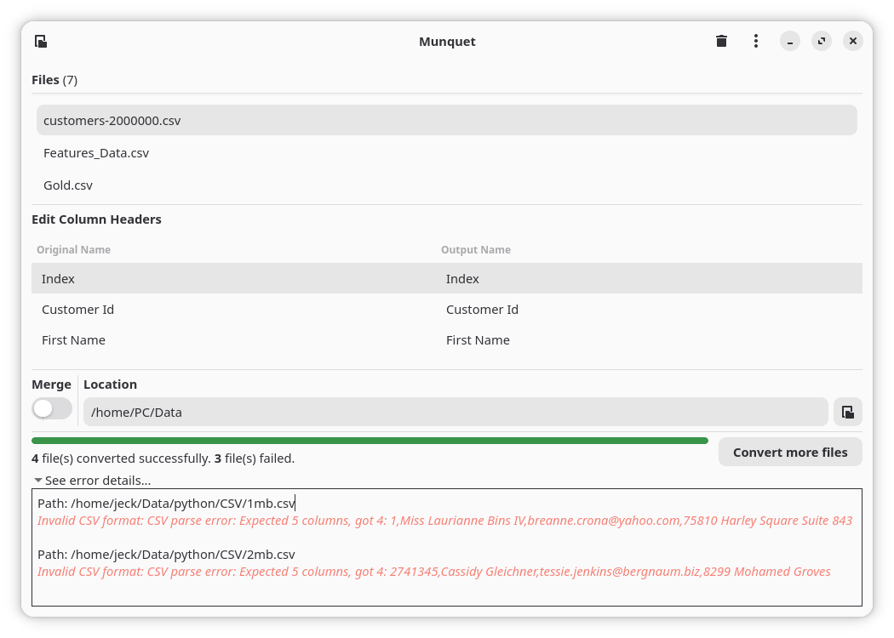
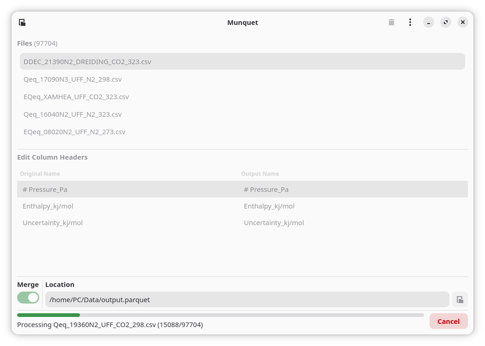

# Munquet

> The source code is hosted here on [GitLab](https://gitlab.com/zulfian1732/munquet).    

**Munquet** is a lightweight desktop tool for preparing and transforming tabular datasets quickly and safely. It converts, merges, and validates files into efficient Apache Parquet format — reducing file size, improving performance, and simplifying downstream analytics workflows.

---

## 🚀 Version
**0.2.0**     
For detailed changes, see the [CHANGELOG](CHANGELOG.md).

  
*Dataset conversion with column mapping and error handling.*

  
*Merging multiple datasets with progress tracking.*

---

## ✨ Features

- Convert CSV/TSV files to Parquet format.
- Merge multiple files into a single dataset.
- Rename column headers with validation (no empty or duplicate names).
- Built-in validation to prevent mismatched or inconsistent files.
- Batch processing with progress and clear results.
- Works fully offline. 
    
---

## 📦 Installation

Munquet is available **Flathub**.

### Build from Flathub (Recommended)

```bash
flatpak install flathub io.gitlab.zulfian1732.munquet
```

Run:

```bash
flatpak run io.gitlab.zulfian1732.munquet
```

---

## 🧪 Development Build (.Devel)

A development build is available for testing new features.  
It can be installed alongside the stable version.

Clone the repository and build locally:
 

```bash
git clone https://gitlab.com/zulfian1732/munquet.git
cd munquet
flatpak-builder --user --install --force-clean build-dir io.gitlab.zulfian1732.munquet.Devel.json
```

Run the development version:

```bash
flatpak run io.gitlab.zulfian1732.munquet.Devel
```

> ⚠️ The development build may contain experimental features and unstable changes.

---

## 👨‍💻 Author

Zulfian

If you find **Munquet** useful and want to support future updates, you can make a small contribution here:
[**Send support via Ko-fi**](https://ko-fi.com/zulfian1732)

Your support helps maintain and improve Munquet for modern Linux environments.

---

## 📄 License
See [LICENSE](LICENSE)

